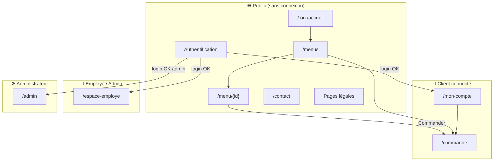
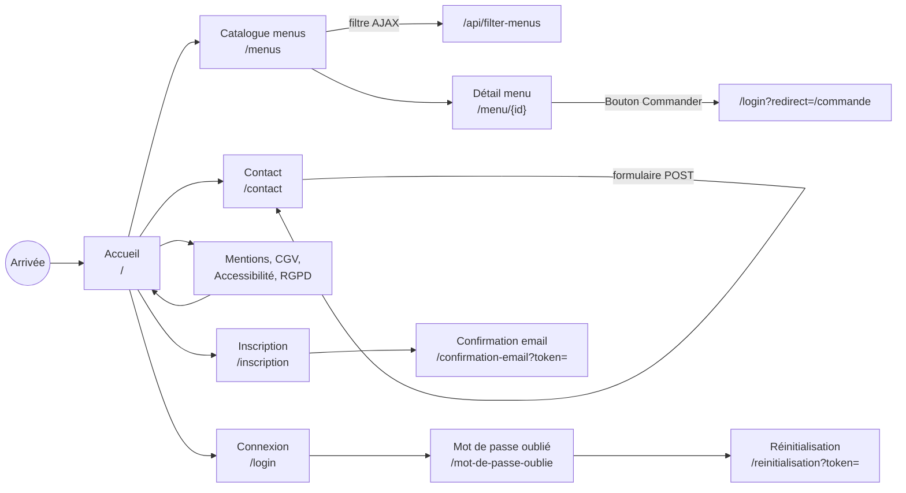
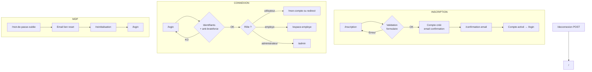
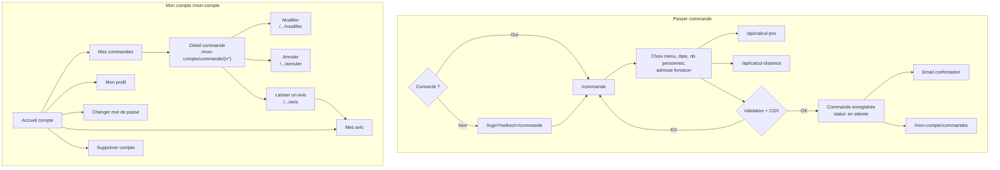
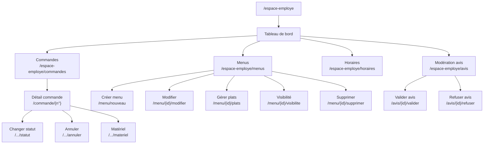
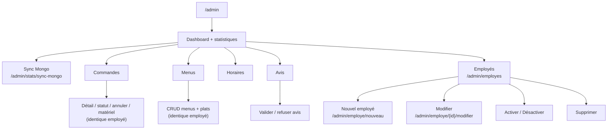
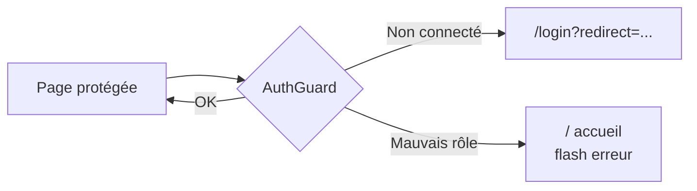

# Organigramme des parcours — Vite et Gourmand

Cartographie des parcours utilisateur du site, basée sur `src/Router.php` et les contrôleurs.

## Rôles et accès

| Rôle | Session | Espace principal | Accès restreint |
|------|---------|------------------|-----------------|
| **Visiteur** | Non connecté | Pages publiques | Commande, mon compte |
| **Utilisateur** (client) | `role = utilisateur` | `/mon-compte` | Espace employé, admin |
| **Employé** | `role = employe` | `/espace-employe` | Admin exclusif |
| **Administrateur** | `role = administrateur` | `/admin` | Tout (employé + gestion employés + stats) |

> L'administrateur accède aussi aux fonctionnalités employé (menus, commandes, avis, horaires).

---

## Vue d'ensemble du site

---

## Parcours visiteur (public)

---

## Parcours authentification

---

## Parcours client — commande et compte

**Règles métier commande client :**
- Modification / annulation selon statut et délai (config `commande.php`)
- Avis possible après prestation livrée

---

## Parcours employé — `/espace-employe`

Accessible aux rôles **employé** et **administrateur**.

**Catalogue (employé) :**
- Création menu : photo obligatoire, masqué par défaut (`visible = 0`)
- Visibilité : minimum 3 plats avec photo
- Galerie auto : couverture + 3 premiers plats photo

---

## Parcours administrateur — `/admin`

Réservé au rôle **administrateur**. Reprend l'espace employé + fonctions exclusives.

**Stats admin :**
- Source MongoDB Atlas si disponible, sinon MySQL
- Bouton synchronisation MySQL → Mongo (ECF)

---

## APIs internes (AJAX)

| Route | Usage |
|-------|--------|
| `GET /api/filter-menus` | Filtrage catalogue (régime, prix, personnes…) |
| `POST /api/calcul-prix` | Calcul tarif commande |
| `POST /api/calcul-distance` | Distance livraison depuis Bordeaux |

---

## Pages légales (footer)

- `/mentions-legales`
- `/cgv`
- `/accessibilite`
- `/politique-confidentialite`

---

## Schéma des redirections de sécurité

| Zone | Garde |
|------|-------|
| `/commande`, `/mon-compte/*` | Connexion client |
| `/espace-employe/*` | Rôle employé ou admin |
| `/admin/*` | Rôle administrateur uniquement |

---

*Généré à partir du code source — juillet 2026*
