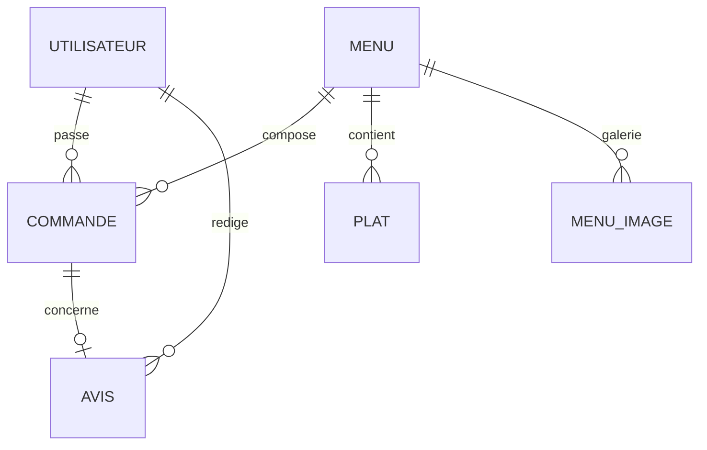

# Documentation technique — Vite et Gourmand

> **Livrable ECF** — Réflexions techniques, environnement, données, UML, déploiement.  
> Broaderillon à enrichir puis exporter en PDF.

---

## 1. Réflexions techniques initiales

### Pourquoi PHP MVC maison (sans framework) ?
- Maîtrise complète du cycle requête → routeur → contrôleur → modèle → vue.  
- Adapté au périmètre ECF et à un hébergement mutualisé (Infomaniak).  
- Pédagogique : AuthGuard, CSRF, PDO, services métier visibles.

### Pourquoi MySQL ?
- Source de vérité relationnelle (utilisateurs, menus, commandes, avis).  
- Standard sur hébergement mutualisé, import SQL simple.

### Pourquoi MongoDB (optionnel) ?
- Exigence ECF sur une brique NoSQL pour les **statistiques** admin.  
- MySQL reste la référence opérationnelle ; sync MySQL → Mongo à la demande.

### Front-end
- **Mobile first** (CSS Flexbox / Grid).  
- JavaScript vanilla (filtres menus, commande, galerie) — pas de dépendance lourde.

### Alternatives écartées (à développer dans le rapport final)
- Laravel / Symfony : trop « boîte noire » pour l’objectif pédagogique.  
- SPA React : hors besoin (pages serveur PHP suffisantes).

---

## 2. Configuration de l’environnement

| Environnement | Outils |
|---------------|--------|
| Local | Windows, Laragon (Apache, MySQL, PHP 8), Git, Composer, Cursor |
| Production | Infomaniak, sous-domaine `vite-et-gourmand.anteusweb.com`, DocumentRoot = `public/` |
| Versions | Voir `README.md` (prérequis) |

Procédure d’install locale : **README** du dépôt.  
Procédure prod : `docs/DEPLOIEMENT-INFOMANIAK.md`.

---

## 3. Modèle de données

### Principales entités
- **Utilisateur** (rôles : utilisateur, employe, administrateur)  
- **Menu** / **Plat** / images galerie  
- **Commande** (+ lignes, statuts, matériel)  
- **Avis** (modération)  
- **Horaire**

Référence SQL : `sql/schema.sql` + `sql/donnees_test.sql`.

### À produire pour le PDF
- [ ] MCD (Mermaid / Draw.io / PowerDesigner)  
- [ ] Diagramme de classes (optionnel mais valorisant)

---

## 4. Diagrammes UML

### Cas d’utilisation (à finaliser)
Acteurs : Visiteur, Client, Employé, Administrateur.  
Cas : Consulter menus, S’inscrire, Commander, Gérer commande, Modérer avis, Gérer employés, Consulter stats…

### Séquences prioritaires
1. Inscription + confirmation e-mail  
2. Passage de commande  
3. Changement de statut commande (employé)  
4. Upload photo menu / plat  

*Sources : `docs/PARCOURS-SITE.md`, `src/Router.php`, contrôleurs.*

---

## 5. Sécurité (synthèse)

| Mesure | Implémentation |
|--------|----------------|
| Mots de passe | `password_hash` / bcrypt |
| CSRF | Jetons sur formulaires sensibles |
| XSS | `htmlspecialchars` en vues |
| Accès | `AuthGuard` (connexion + rôle) |
| Brute-force | Limitation tentatives de connexion |
| Upload | MIME, taille max, ré-encodage GD |

---

## 6. Déploiement

1. Création BDD Infomaniak + import `schema.sql` / `donnees_test.sql`  
2. Upload FTP (hors secrets `*.local.php`)  
3. DocumentRoot → `public/`  
4. Config `database.local.php`, `mail.local.php`, éventuellement Mongo  
5. Tests des parcours (manuel utilisateur)

Détail : `docs/DEPLOIEMENT-INFOMANIAK.md`.

---

## 7. Points de vue / retours d’expérience

*(À rédiger en fin de projet : ce qui a bien fonctionné, difficultés Infomaniak/Mongo, perf images, accessibilité…)*
